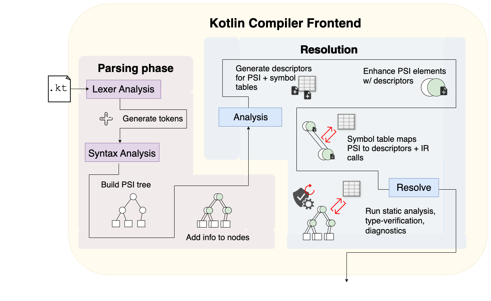

# Kotlin-Compiler-Crash-Course
A repository of helpful sources to figure out what the Kotlin compiler really is. Consider this as more of scratchnotes hopefully useful to your Kotlin research.

Article series on Medium:
1. [Frontend: Parsing phase](https://medium.com/google-developer-experts/crash-course-on-the-kotlin-compiler-1-frontend-parsing-phase-9898490d922b)
2. [WIP Frontend: Resolution phase](https://docs.google.com/document/d/17dBSxlXRW7PRD92QZGcGeotnsPSOsp0NSdnFXXZ41sg/edit?usp=sharing)


* A compiler is a computer program that translates computer code written in one programming language into another language: the target language.
    * Normally used for programs that translate from one higher language to a lower-level language to create an executable program

* The frontend verifies syntax and semantics. For statically-typed languages, it performs type-checking by collecting type information
    * If the input program is syntactically incorrect, or has a type error, it generates error and/or warning messages, usually identifying the location in the source code
    * Other aspects of the frontend:
        * Lexical analysis (parsing phase)
        * Syntax analysis  (parsing phase)
        * Semantic analysis (resolution phase)
    * The frontend transforms the input program into an intermediate representation 
* The middle-end performs optimizations on IR that are independent of the CPU architecture being targets
    * i.e. removing dead code, unreachable code, discovery and propagation of constant value, refactoring
* The back-end takes the optimized IR the middle end. It may perform more analysis, transformations + optimizations that are specific for the target CPU architecture 
    * Responsible for the multithreading and other parallel processing 
    
## Kotlin Frontend

There are actually two frontends, k1 and k2. K2, otherwise known as FIR frontend, is the new frontend for Kotlin compiler, which will replace the existing frontend (FE10). 

**Fe10 Frontend** 


**Fir Frontend** 


## Phases of the Frontend

### Lexer

The lexer phase breaks source code text into a sequence of lexical tokens:
* [KotlinLexer.g4](https://github.com/Kotlin/kotlin-spec/blob/master/grammar/src/main/antlr/KotlinLexer.g4)
* This phase can then split into 2 phases:
    * Scanning: segments input text into syntactic units and assign them a category
    * Evaluating: converts lexemes into a processed val

### Parser - Syntactic Analysis

* Involves parsing the token sequence to identify the syntactic structure of the program
    * This phase typically builds a parse tree. A parse tree is often analyzed, augmented, and transformed by later phases in the compiler. 

* [JetBrains IntelliJ SDK Documentation: Implementing Parser and PSI](https://www.jetbrains.org/intellij/sdk/docs/reference_guide/custom_language_support/implementing_parser_and_psi.html)
* [JetBrains Plugins: PSIViewer Library](https://plugins.jetbrains.com/plugin/227-psiviewer)

### PSI/AST trees
According to the Kotlin compiler, a PSI, or Program Structure Interface, tree is built on top of the AST, adding semantics and methods for manipulating specific language constructs.

The AST nodes have a direct mapping to text ranges in the underlying document. The bottom-most nodes of the AST match individual tokens returned by the lexer, and higher level nodes match multiple-token fragments. Operations performed on nodes of the AST tree, such as inserting, removing, reordering nodes and so on, are immediately reflected as changes to the text of the underlying document ([Implementing Parser and PSI](https://www.jetbrains.org/intellij/sdk/docs/reference_guide/custom_language_support/implementing_parser_and_psi.html)).

The AST is used intensively during semantic analysis, where the compiler checks for correct usage of the elements of the program and the language. It also describes an abstracted representation of what a user writes in Kotlin. AST allows us to change the surface syntax of the language without changing the rest of the compiler (although that rarely happens),

* [Washington CS Course 401: Abstract Syntax Parsing Trees](https://courses.cs.washington.edu/courses/cse401/08wi/lecture/AST.pdf)
* [Grinnell College CS Course 362: Semantic Actions](http://www.cs.grinnell.edu/~rebelsky/Courses/CS362/98F/Outlines/outline.15.html)
* [Grinnell College CS Course 365: Abstract Parse Trees](http://www.cs.grinnell.edu/~rebelsky/Courses/CS362/98F/Outlines/outline.16.html)
* [Architecture-driven Modernization: Abstract Syntax Tree Metamodel (ASTM)](https://www.omg.org/spec/ASTM/1.0/PDF)
* [The Disadvantages of AST](https://vinaytech.wordpress.com/tag/disadvantages-of-ast/)

* [Eclipse plugin: AST View](https://www.eclipse.org/jdt/ui/astview/index.php)

### Semantic analysis - Resolution 

* performs semantic checks such as type-checking, object binding, or definite assignment
    * Semantic analysis usually requires a complete parse tree
* [ResolutionResultsHandler.kt](https://github.com/JetBrains/kotlin/blob/9ba7907b815780531d27fe9be0cfe3308f50111f/compiler/frontend/src/org/jetbrains/kotlin/resolve/calls/results/ResolutionResultsHandler.java)
* [Wikipedia: Compiler](https://en.wikipedia.org/wiki/Compiler)

Updated March 20, 2023

* Compiler doesn’t modify PSI at all
* `:compiler:resolution` and `:compiler:frontend` and `:compiler:frontend.java` modules work together and produces the BindingContext 
    * BindingContext - Big map which contains information about all program in pair to PSI
    * After that, old backend takes PSI and BindingContext and generates byte code over it
    *  JVM IR backend transforms PSI + BindingContext to IR and after that works with it
* Why was `:compiler:resolution` and `:compiler:frontend` kept separate?
    * The idea was to keep in different modules logic which depends and does not depend on PSI, but found later that core problem of old frontend not just PSI, but descriptors also
* Frontend stores all information that it infers - types, descriptors, diagnostics, constant evaluation, CFA results within BindingContext, where (in most cases) PSI is a key to a specific map in which it contains descriptors


* FIR takes raw PSI as input, produces RawFIR, which transforms in different stages, filling the tree with semantic information, and then resolved FIR is transformed to backend IR, which is input for the backend
* `:fir2ir` is another intermediary code generator which transforms to IR


Credit to Abel Naya from this Slack thread: https://kotlinlang.slack.com/archives/C7L3JB43G/p1615394755006000

See more here:
* https://kotlinlang.slack.com/archives/C7L3JB43G/p1615394755006000 
* https://docs.google.com/presentation/d/e/2PACX-1vTzajwYJfmUi_Nn2nJBULi9bszNmjbO3c8K8dHRnK7vgz3AELunB6J7sfBodC2sKoaKAHibgEt_XjaQ/pub?slide=id.g955e8c1462_0_45

#### Resolution

* The Kotlin compiler - https://slack-chats.kotlinlang.org/t/8294557/hey-i-am-really-interested-in-studying-the-source-code-but-i#b8d76d63-3c33-4c84-8eb8-460fc438784d
    * K1 and K2 frontends and JVM, JS, Native, and WASM Backends
* Key debugging points (as referenced in slack)
    * Triggers frontend to resolve all the files
        * FirKotlinToJvmBytecodeCompiler::[findMainClass::visitSimpleFunction](https://github.com/JetBrains/kotlin/blob/master/compiler/cli/src/org/jetbrains/kotlin/cli/jvm/compiler/FirKotlinToJvmBytecodeCompiler.kt#L313)
        
        
        
* Converts Frontend IR into BackendIR
    * CompilationContext.runFrontend::[providerAndScopeForIncrementalCompilation](https://github.com/JetBrains/kotlin/blob/master/compiler/cli/src/org/jetbrains/kotlin/cli/jvm/compiler/FirKotlinToJvmBytecodeCompiler.kt#L189)
    
    


### FIR Generation within Resolution
* FIR (aka Frontend IR) is the new frontend for Kotlin compiler, which will replace the existing frontend (FE10), which is based on PSI, descriptors, and `BindingContext`
* Two main goals of FIR
    * Increase compiler performance
    * Write new clean architecture of frontend because FE10 is a “piece of crap"
        * To achieve this, we decided to get rid of all structures form FE 1.0 listed above and replace it with a new data structure which is semantic (not syntax) tree which represents user code
* FIR tree is a mutable tree, built from results of parser (PSI or other parser results) and in this raw form, it is close to PSI (which contains only information directly written in the code). 
    * At this stage we already perform some desugaring to sampling further resolve (i.e. replace if statements with when, or transform for **loops** to **while loops**
* After raw FIR is built, we pass it to a number of processors, which resolves code and represents different stages of the compiler pipeline. These stages are applied to all files of module in bulk:
    * `IMPORTS` — resolve all import directives (find corresponding package for each import)
    * `SUPER_TYPES` - resolve all super types of all classes (resolve here means finding classId (fan) for each type
    * `SEALED_CLASS_INHERITORS` - find inheritors of sealed classes
    * `TYPES` - resolve rest explicitly default types of declarations (receivers, value parameters, return types)
    * `STATUS` - resolve and infer visibility, modality and modifiers of all declarations
    * `CONTRACTS` - resolve contracts of all functions 
    * `IMPLICIT_TYPES_BODY_RESOLVE` - infer return types for all functions and properties without explicit return type (which includes analysis of their bodies)
    * `BODY_RESOLVE` - analyst bodies of all other function sand properties
* There is also a last CHECKERS stage, which takes FIR and reports different diagnostics (warnings and errors)
* After all those stages are completed, resolved FIR is passed to :fir2ir component, which produces backend IR, which is used by backend to generate platform code

##### FIR Module structure in Kotlin project
*  All compiler modules lays in :compiler directory, and all FIR related modules are in :compiler:fir
* Main modules 
    * `:compiler:fir:tree` contains almost all nodes of FIR tree
    * `:compiler:fir:cones` contains classes for FIR type system
    * `:compiler:fir:resolve` contains main logic of resolution with all compiler phases
    * `:compiler:fir:checkers` - for diagnostics 
    * `:compiler:fir:fir2ir`
    * `:compiler:fir:entrypoint` - This is the entry point to the entire FIR compiler. Take a look for FirAnalyzerFacade if you want to discover how deep the rabbit hole goes

#### Fe10 v. FIR
*  Main problems of performance in FE 1.0 were related to bad code locality and memory locality. All descriptors were lazy and because of that, the compiler always jumps between different parts of code, which kills a number of JIT optimizations. 
    * Also all information about resolution was stored in on big map of maps (binding context) so CPU cannot cache objects well enough
* Some phases described needs global resolution (eg. Resolve super types of some class we need to resolve super types of those super types)
    * Some are very local - to resolve type of value parameter you don’t need to access anything else except some provider which can find declaration by name
    * Local phases may be parallelized because checkers cannot modify the tree, only read data form it 
* FIR internals are not stable, but base architecture is mostly stable
* Each body is resolved once
    * Some bodies are resolved on one phase and other on another

#### Analysis API
 - one form of the CLI, but not necessary to understand the frontend portion of the compiler. Still:
 
```
KtLifetimeOwner                                <— start’s here as lifecycle being passed through
KtSmartCastProviderMixIn,                     <— returns nullable or non-nullable info
KtCallResolverMixIn,                          <— resolving the given name expression to an 
                                                   access call if the name references a property
KtSamResolverMixIn,                           <— returns initialization (
KtDiagnosticProviderMixIn,                    <— start diagnostics
KtScopeProviderMixIn,                         <— gets all possible types of ktTypes a article expression belongs to
KtCompletionCandidateCheckerMixIn,            <— Checker 
KtSymbolDeclarationOverridesProviderMixIn.    <— render symbols + types into strings
KtExpressionTypeProviderMixIn,                <—  { “ safasdf “} is now recognized as 
                                                    KtExpression { “String } 
KtPsiTypeProviderMixIn,                       <— Creates the newly generated KtType’s relevant PSI types of the structure 
KtJvmTypeMapperMixIn,                         <— map ASM JVM —> KtType 
KtTypeProviderMixIn,                          <— relates KtTypes to one another ie. super types
KtTypeInfoProviderMixIn,                      <— Gives info on Kotlin type i.e.
                                                    - is functional interface/class
                                                    - can be null
                                                    - is array or nested array                
KtSymbolProviderMixIn,                        <— Generates corresponding symbol to indicate source of the PSI element
                                                    - Kotlin source
                                                    - Kotlin source-generated i.e. data classes generate copy, 
                                                        component{N}, toString
                                                    - Java source
                                                    - SAM constructor
                                                    - delegated
                                                    - Java synthetic property
                                                    - property baby field                                
        
KtSymbolContainingDeclarationProviderMixIn,   <- returns symbols for modules and class symbols/type parameters/functions
KtSymbolInfoProviderMixIn,                    <- returns information for symbols i.e.
                                                    - deprecation
                                                    - setter/getter deprecation
                                                    - java setter/getter name
KtSubtypingComponentMixIn,                     <— Gets subtypes of Kotlin type
KtExpressionInfoProviderMixIn,                <— returns expression target symbols, missing when cases for Kotlin, 
                                                    determine if expression is being used  
KtCompileTimeConstantProviderMixIn,           <— evaluate constant expressions free from runtime behaviors/changes 
KtSymbolsMixIn,                                <— restore symbol(?)
KtReferenceResolveMixIn,                      <— ties KtReferences (PsiPolyVariantSymbols) to KtSymbols
KtReferenceShortenerMixIn,                    <— shorten imports 
KtImportOptimizerMixIn,                       <— analyzes for unused imports
KtSymbolDeclarationRendererMixIn,             <— renders symbols and types into strings  (for testing)
KtVisibilityCheckerMixIn,                      <— determines which symbols are intended for public API
KtMemberSymbolProviderMixin,                   <— 
KtInheritorsProviderMixIn,                     <— get sealed class inheritors and enum entries
KtTypeCreatorMixIn,                            <— build class and parameter type
KtAnalysisScopeProviderMixIn,                  <— provides scope of analysis  
KtSignatureSubstitutorMixIn,                   <— performs substitutions for mixed collection types i.e. 
                                                    substitutor = { T -> Int, S -> Long }
                                                    substitute(Map<T, S>, substitutor) = Map<Int, Long>
KtScopeSubstitutionMixIn,                      <— get the scope of the delegating type or the composite type 
KtSymbolProviderByJavaPsiMixIn                 <— get class or object kind
```

## Middle-end phases of the Compiler

* Also known as the optimizer, performs optimizations on the intermediate representation
* Analysis: data analysis from the intermediate representation
    * Data-flow analysis
    * Alias analysis
    * Pointer analysis
    * Escape analysis
* Accurate analysis is the basis for any compiler optimization
    * Control flow graph
    * Call graph
* Complier analysis is a prerequisite for any compiler optimization

## Backend of the Complier 

* Responsible for the CPU architecture-specific optimizations and for code generation
* Machine-dependent optimizations: optimizations that depend on the details of the CPU architecture that the compiler targets
* Code Generation: transforms IR into the output language, usually the native machine language of the ysstem
    * Resource and storage decisions

## More resources around the Kotlin Compiler

* [vektory79 CompileTest.kt](https://github.com/vektory79/kotlin-script-parser-test/blob/master/src/main/java/hello/CompileTest.kt)

* [Logo Compiler written by Cesar Enrique](https://github.com/caenrique/logoCompiler)

